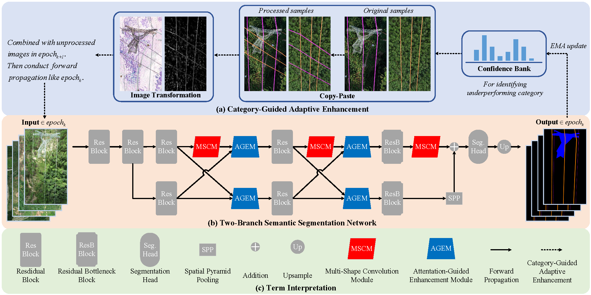

# AFENet

A PyTorch implementation of AFENet, a semantic segmentation network for segmenting power lines and transmission towers from aerial images.

## Datasets

This work utilizes the following datasets for training and evaluation:
*   [PLD-UAV Dataset](https://github.com/SnorkerHeng/PLD-UAV)
*   [TTPLA Dataset](https://github.com/R3ab/ttpla_dataset.git)

## Pretrained Models

We provide a pretrained model:
**Download Link**:  
Baidu Netdisk: iter_20000.pth  
Link: https://pan.baidu.com/s/1-gTRECoMET65Lq1gGTybcQ  
Extraction code: 6666
